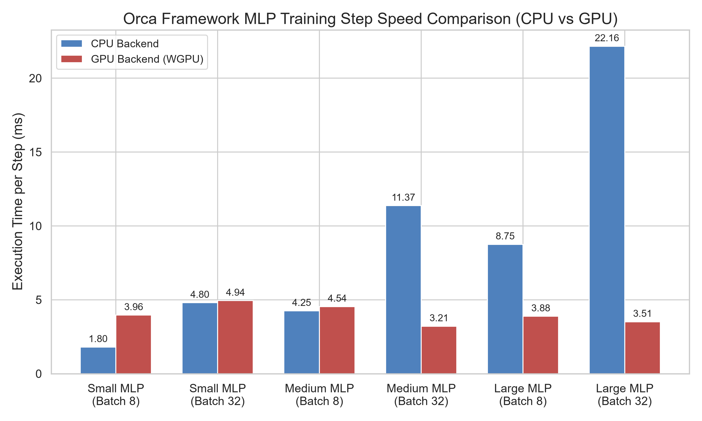

# Orca: Progressive Machine Learning Framework

**"Simple by default. Powerful when needed."**

Orca is a lightweight, modular, and high-performance Machine Learning framework built from the ground up. It leverages the memory safety and native execution speed of **Rust** for its core computational backend, while exposing a clean, intuitive, and PyTorch-compatible API through **Python**. 

Currently at version 0.5.0, Orca focuses on providing an extensible architecture where foundational elements like Autograd engines and mathematical primitives are completely decoupled from the physical execution layer (CPU/GPU).

---

## Core Features

- **PyTorch-like Python Frontend**: Designed for immediate familiarity. The framework implements standard abstractions such as `Tensor`, `nn.Module`, `optim.SGD`, and `DataLoader`.
- **Reverse-Mode Autograd Engine**: A robust, tape-based automatic differentiation engine written entirely in Rust, dynamically building computation graphs during the forward pass.
- **Modular Backend Architecture**: Core ML primitives (mathematical operations, multidimensional shapes, broadcasting) are strictly decoupled from hardware backends. Backends can be swapped seamlessly without rewriting the autograd or frontend layers.
- **Safe, Fast, and SIMD-Ready**: Built 100% in Rust with zero legacy C/C++ dependencies. The CPU backend uses custom aligned memory allocators (64-byte alignment) to ensure type-safe slice casting and future-proof AVX-512/SIMD support.
- **Seamless Python Integration**: Native bindings generated using [PyO3](https://pyo3.rs/) and built using [Maturin](https://maturin.rs/) to guarantee zero-overhead interoperability.

---

## Architecture Structure

The repository is highly decoupled to prevent circular dependencies and enforce clean abstractions. The workspace is divided into the following crates:

- `orca-core/`: The foundational layer. Defines core traits (`Backend`), `Shape`, `DType`, `Device`, and unified error handling (`OrcaError`, `Result`).
- `orca-tensor/`: The multidimensional array representation (`Tensor<B: Backend>`) and forward-pass mathematical operations.
- `orca-autograd/`: The reverse-mode Automatic Differentiation Engine (`Autodiff<B>`) utilizing a Tape-based computation graph for dynamic backpropagation.
- `orca-backend-cpu/`: The reference implementation for a single-threaded CPU Backend featuring robust type dispatching and aligned raw memory storage.
- `orca-backend-gpu/`: An experimental wgpu-based backend designed for cross-platform parallel shader execution.
- `orca-python/`: The Rust-to-Python FFI (Foreign Function Interface) bindings.
- `python/orca/`: The Python frontend providing Object-Oriented ML blocks (`nn`, `optim`, `data`) and autocompletion interfaces.

---

## Installation & Setup

### Prerequisites
- **Python:** 3.10 or higher.
- **Rust:** Stable toolchain via [rustup](https://rustup.rs/).

### Development Installation

1. Clone the repository to your local machine.
2. Create and activate a Python virtual environment:
   ```bash
   python -m venv .venv
   
   # On Linux / macOS:
   source .venv/bin/activate
   
   # On Windows:
   .venv\Scripts\Activate.ps1
   ```
3. Install the Rust bindings compiler (`maturin`) and build the framework:
   ```bash
   pip install maturin
   maturin develop --release
   ```

---

## Quick Start Guide

The Python API provides two interface levels to construct and train networks.

### Standard Procedural API (Recommended)

Orca recommends the standard procedural interface for default workflows. It provides direct, explicit control over forward execution, loss calculation, and backpropagation step execution:

```python
import orca
from orca import Tensor
import orca.nn as nn
import orca.optim as optim

# 1. Define the Model Architecture
model = nn.Sequential(
    nn.Flatten(),
    nn.Linear(64, 32),
    nn.ReLU(),
    nn.Linear(32, 10)
)

# 2. Define Loss Function and Optimizer
loss_fn = nn.CrossEntropyLoss()
optimizer = optim.SGD(model.parameters(), lr=0.01)

# 3. Create Dummy Data
dummy_input = orca.randn([32, 64], requires_grad=False)
dummy_target = orca.zeros([32, 10], requires_grad=False) # Labels representation

# 4. Forward Pass
predictions = model(dummy_input)
loss = loss_fn(predictions, dummy_target)

# 5. Backward Pass and Optimization
optimizer.zero_grad()
loss.backward()
optimizer.step()

print(f"Training Step Completed. Loss: {loss.to_list()}")
```

### Advanced Orchestration API

For specialized pipelines requiring managed lifecycles, Orca offers an advanced `nn.Model` abstraction that encapsulates model compilation states, automated validation steps, metric logging, and model fitting loops.

```python
import orca
import orca.nn as nn

# 1. Define the Model subclassing nn.Model
class MyModel(nn.Model):
    def __init__(self):
        super().__init__()
        self.flatten = nn.Flatten()
        self.fc1 = nn.Linear(64, 32)
        self.relu = nn.ReLU()
        self.fc2 = nn.Linear(32, 10)

    def forward(self, x):
        x = self.flatten(x)
        x = self.fc1(x)
        x = self.relu(x)
        x = self.fc2(x)
        return x

# 2. Instantiate and Compile Model
model = MyModel()
model.compile(optimizer='adam', loss='crossentropy', metrics=['accuracy'])

# 3. Create Dummy Data
dummy_input = orca.randn([32, 64])
dummy_target = orca.zeros([32, 10])

# 4. Train Model using High-Level fit API
model.fit(dummy_input, dummy_target, epochs=5)
```

---

## Performance & Benchmarks

To evaluate the execution efficiency and scaling properties of the CPU and GPU backends, systematic benchmarks were conducted on a 3-layer Multi-Layer Perceptron (MLP) architecture (Input: 784, Hidden 1: H, Hidden 2: H, Output: 10) across different hidden layer sizes (H = 64, 256, 512) and batch sizes (N = 8, 32).

### Execution Speed and Throughput Comparison

The table below outlines the average execution time per training step (forward pass, cross-entropy loss computation, and backward pass) and the corresponding processing throughput.

| Model Configuration | Batch Size | CPU Time (ms) | GPU (WGPU) Time (ms) | CPU Throughput (samples/s) | GPU (WGPU) Throughput (samples/s) | Speedup (GPU vs CPU) |
| :--- | :---: | :---: | :---: | :---: | :---: | :---: |
| **Small MLP** (H = 64) | 8 | 1.80 | 3.96 | 4444.77 | 2022.39 | 0.45x |
| **Small MLP** (H = 64) | 32 | 4.80 | 4.94 | 6666.49 | 6480.25 | 0.97x |
| **Medium MLP** (H = 256) | 8 | 4.25 | 4.54 | 1881.50 | 1760.76 | 0.94x |
| **Medium MLP** (H = 256) | 32 | 11.37 | 3.21 | 2813.88 | 9962.94 | 3.54x |
| **Large MLP** (H = 512) | 8 | 8.75 | 3.88 | 913.92 | 2060.60 | 2.25x |
| **Large MLP** (H = 512) | 32 | 22.16 | 3.51 | 1444.13 | 9118.24 | 6.31x |



### Key Observations and Analysis

#### 1. Hardware Scheduling and Shader Launch Overhead
For workloads with smaller dimensions (e.g., Small MLP at Batch Size 8), the CPU backend demonstrates lower latency than the GPU backend. This behavior is attributed to the fixed overhead associated with GPU shader command submission, pipeline binding, and queue synchronization via the WebGPU API. When the actual compute payload is tiny, these kernel launch latencies dominate the overall execution time.

#### 2. Workload Scaling and Parallelization Gains
As the size of the model and the batch size scale up, the massive parallel computing architecture of the GPU backend begins to yield significant performance improvements. For the Large MLP configuration at a batch size of 32, the GPU backend achieves a step latency of 3.51 ms compared to 22.16 ms on the CPU, representing a 6.31x speedup and a processing throughput of 9,118.24 samples per second.

For isolated matrix multiplications of size 1024x1024:
- **CPU Backend (using aligned raw slices)**: 40.46 ms per matmul.
- **GPU Backend (using parallel compute shaders)**: 0.48 ms per matmul.
This yields an approximate 84x acceleration factor for compute-bound GEMM primitives.

#### 3. Gradient Tape Management
To maintain peak performance, the computational graph stored on the Autograd tape (Wengert List) must be explicitly managed. Calling `zero_grad()` at the beginning of each training step is critical. This operation clears the accumulated history from the tape, resetting the graph size back to a single step and avoiding linear latency accumulation.

---

## Roadmap and Project Status

The framework is actively developed and has progressed to a feature-complete state for core deep learning training and inference pipelines. Below is the detailed development roadmap and the current status of each phase.

- **Phase 1: Foundation (Completed)**
  - Established cargo workspace and core abstraction layers (`orca-core`).
  - Implemented 64-byte aligned memory allocation to guarantee safe slice casting and AVX-512 vectorization layout.
  - Built multi-dimensional `Shape` tracking and basic element-wise operators.
- **Phase 2: Autograd Engine & PyO3 Bindings (Completed)**
  - Implemented a tape-based reverse-mode automatic differentiation engine (`orca-autograd`).
  - Configured high-performance Python FFI bindings using Maturin and PyO3.
- **Phase 3: Broadcasting & Non-Linear Operators (Completed)**
  - Added broadcasting mechanism (`expand` and `sum_to_shape`) support in backward propagation.
  - Implemented mathematical primitives (`exp`, `log`, `transpose`).
  - Verified convergence on XOR classification problems.
- **Phase 4: ML Primitives & Digit Verification (Completed)**
  - Implemented standard neural network components: `nn.Linear`, `nn.ReLU`, and `nn.Flatten`.
  - Added loss metrics: `nn.CrossEntropyLoss` and `nn.MSELoss`.
  - Solved gradient accumulation bugs by separating overwriting assignments from additive accumulation.
- **Phase 5: GPU Acceleration (Completed)**
  - Developed `orca-backend-gpu` utilizing WebGPU (`wgpu`) compute pipelines.
  - Solved hardware driver limits by decomposing large 1D transpose workgroup sizes into a 2D dispatch grid.
  - Addressed numerical overflow limits in Tanh activations.
- **Phase 6: Advanced Architectures & Weight Loaders (Completed)**
  - Implemented `nn.Conv2d`, `nn.MaxPool2d`, `nn.BatchNorm2d`, `nn.LayerNorm`, `nn.Embedding`, and `nn.TransformerBlock`.
  - Created blueprints for ResNet-18, BERT-base, and GPT-2 (incorporating weight tying).
  - Developed an integrated Hugging Face weight loader mapping safetensors directly into Orca modules.
- **Phase 7: ONNX Integration & Roundtrips (Completed)**
  - Designed the ONNX model exporter converting the autograd graph into standard ONNX schemas.
  - Implemented the ONNX importer to rebuild functional `nn.Module` objects from optimized ONNX graphs.
- **Phase 8: Quantization & Distributed Execution (Planned)**
  - Integrate mixed-precision operations (FP16 and BF16 execution layouts).
  - Implement tensor model-parallelism and multi-GPU dispatch capabilities.

---

## Contributing Guidelines

We welcome contributions, bug reports, and optimizations. To maintain repository stability and architectural consistency, all contributions must strictly adhere to the guidelines documented in `doc/foundation/` and the rules below.

### 1. Robust Error Handling
- The use of `.unwrap()`, `.expect()`, or `panic!` is strictly prohibited in library code (`src/` directories across all crates).
- Always propagate errors using the workspace's standard result types (`orca_core::Result` and `OrcaError`).

### 2. Strict Crate Hierarchy
- Do not introduce circular dependencies between workspace crates.
- `orca-core` must remain independent of all other crates.
- `orca-autograd` may only depend on `orca-tensor` and `orca-core`.
- Hardware-specific backends (`orca-backend-cpu`, `orca-backend-gpu`) must only depend on `orca-core`.

### 3. Autograd Tape Integrity
- Any custom layer, forward operation, or optimization step must preserve autograd tracking correctness.
- Ensure that training loop iterations, benchmarking steps, and validation routines explicitly call `zero_grad()` to clear the autograd tape and prevent computational graph accumulation.

### 4. GPU Shader Design
- WGSL compute shaders must be verified against device validation limits.
- High-dimensional operations must support decomposed workgroup dispatches to avoid exceeding the Vulkan/DirectX 12 thread boundary constraints (65,535 threads per dimension).

### 5. Code Quality and Testing
- Run Rust formatters and linters before committing:
  ```bash
  cargo fmt --all
  cargo clippy --workspace --all-targets -- -D warnings
  ```
- Ensure all Python test suites run successfully:
  ```bash
  pytest python/tests
  ```

---

## License

This project is licensed under the MIT License or Apache-2.0 License.
