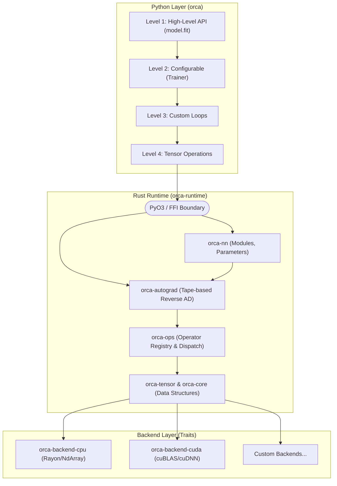

# Orca — Technical Architecture Bible

This document defines the core architecture, memory model, and operational semantics of the Orca deep learning framework.

## 1. System Overview

Orca follows a layered, progressive abstraction model. Users interact primarily with the Python API, which delegates to a fast Rust runtime, which in turn dispatches to hardware-specific backends.



### Key Design Decisions
1. **Eager Execution First**: Computations are evaluated eagerly to provide immediate feedback and intuitive debugging. Lazy evaluation can be introduced via explicit graph tracing later.
2. **Strict Modularity**: The framework is broken down into small, distinct Rust crates to prevent monolithic codebase rot.
3. **Trait-Based Backend Dispatch**: Operations are generic over a `Backend` trait, enabling seamless switching between CPU, GPU, or future custom hardware without changing model code.
4. **Tape-Based Autograd**: Gradients are computed using a Wengert list (tape), allowing dynamic control flow (loops, conditionals) in the forward pass.

---

## 2. Crate Architecture

The `orca-runtime` workspace is divided into specific, tightly-scoped crates. **Circular dependencies are strictly forbidden.**

```text
orca-runtime/
├── orca-core/         # Fundamental types and errors
├── orca-tensor/       # Tensor storage and views
├── orca-ops/          # Operation definitions and dispatch
├── orca-autograd/     # Automatic differentiation engine
├── orca-backend-cpu/  # CPU backend implementation
├── orca-backend-cuda/ # CUDA backend implementation
├── orca-nn/           # Neural network primitives
├── orca-optim/        # Optimizers and schedulers
├── orca-data/         # Data loading and transforms
├── orca-serialize/    # SafeTensors integration
└── orca-python/       # PyO3 bindings
```

### `orca-core`
- **Purpose**: Defines the foundational vocabulary of the framework.
- **Key Types**: `DType`, `Shape`, `Device`, `OrcaError`.
- **Dependencies**: None.
- **Anti-Responsibility**: Does not handle any memory allocation or operations.

### `orca-tensor`
- **Purpose**: Defines the memory layout, strides, and storage semantics for multidimensional arrays.
- **Key Types**: `Tensor<B: Backend>`, `Storage`, `View`.
- **Dependencies**: `orca-core`.

### `orca-autograd`
- **Purpose**: Tracks computations and computes gradients via reverse-mode AD.
- **Key Types**: `Tape`, `Node`, `Variable`.
- **Dependencies**: `orca-tensor`, `orca-ops`.

### `orca-ops`
- **Purpose**: Defines mathematical operations and their backward (gradient) rules.
- **Key Types**: `Op`, `UnaryOp`, `BinaryOp`, `ReduceOp`.
- **Dependencies**: `orca-tensor`.
- **Anti-Responsibility**: Does not implement the hardware kernels, only the trait signatures and dispatch logic.

### `orca-nn`
- **Purpose**: High-level neural network components.
- **Key Types**: `Module`, `Parameter`, `Linear`, `Conv2d`.
- **Dependencies**: `orca-tensor`, `orca-autograd`.

### `orca-python`
- **Purpose**: Exposes the Rust runtime to Python via PyO3.
- **Key Types**: `PyTensor`, `PyModule`.
- **Dependencies**: All core crates.

---

## 3. Core Abstractions

### 3.1 Tensor and Memory Layout
Tensors in Orca use a strided memory model, similar to NumPy and PyTorch. This allows operations like transpose, slice, and reshape to be zero-copy (returning a `View` rather than allocating).

- **Owned Tensors**: Hold an `Arc<S: Storage>` pointing to physical memory.
- **View Tensors**: Hold the same `Arc` but with customized `Shape` and `Stride` metadata.
- **DType System**: Fully typed at the Rust level, but type-erased dynamically when necessary for Python ergonomics.
- **Device Placement**: Tensors explicitly live on a `Device`. Operations between tensors on different devices will panic/error unless explicitly transferred.

### 3.2 Backend Trait
The `Backend` trait is the heart of hardware abstraction.

```rust
pub trait Backend: Send + Sync + 'static {
    type Storage: Storage;
    
    fn name(&self) -> &str;
    fn device(&self) -> Device;
    
    fn allocate(&self, shape: &Shape, dtype: DType) -> Result<Self::Storage>;
    
    // Core operations
    fn add(lhs: &Self::Storage, rhs: &Self::Storage) -> Result<Self::Storage>;
    fn matmul(lhs: &Self::Storage, rhs: &Self::Storage) -> Result<Self::Storage>;
    // ...
}
```
*Why associated types?* By binding `Storage` as an associated type, we guarantee at compile-time that CPU operations can only execute on CPU storage, preventing device mismatch bugs without runtime overhead.

### 3.3 Autograd Engine (Tape-Based)
Orca uses a dynamically constructed Wengert list (a tape).

1. During the forward pass, if any input tensor requires gradients, the operation records a `Node` on the thread-local (or graph-local) `Tape`.
2. The `Node` stores closures (or struct impls) that know how to compute the backward pass for that specific operation, keeping weak references to the required intermediate tensors.
3. Upon calling `.backward()`, the tape is traversed in reverse topological order, accumulating gradients into a gradient dictionary.

### 3.4 Module System
Unlike PyTorch's inheritance-heavy `nn.Module`, Orca uses a trait-based composition approach.

```rust
pub trait Module<B: Backend> {
    type Input;
    type Output;
    
    fn forward(&self, input: Self::Input) -> Self::Output;
    fn state_dict(&self) -> StateDict;
    fn load_state_dict(&mut self, state: &StateDict) -> Result<()>;
}
```

---

## 4. Python-Rust Bridge (PyO3)

The Python API is a thin wrapper over the Rust API.
- **GIL Management**: Rust releases the Python Global Interpreter Lock (GIL) for any expensive computation (matmul, conv) using `Python::allow_threads`.
- **Exceptions**: Rust `Result<T, OrcaError>` is automatically converted into Python exceptions (e.g., `ValueError`, `RuntimeError`) via PyO3's `From` trait implementation.
- **Opaque Pointers**: Python does not see the raw Rust data. It holds a PyO3 class (`PyTensor`) which encapsulates an `Arc<Tensor>`.

---

## 5. Memory Model

1. **Reference Counting**: Tensors use `Arc` for interior mutability and shared ownership. Dropping the last Python reference drops the Rust `Arc`, automatically freeing CPU or GPU memory.
2. **Copy-on-Write (CoW)**: If a tensor view is mutated in-place, and the reference count is > 1, the memory is copied before mutation to preserve functional purity for other owners.
3. **GPU Memory Pool**: Future CUDA implementations will use an arena/pool allocator to prevent synchronous CUDA malloc/free overhead.

---

## 6. Concurrency Model

- **Data Parallelism**: `orca-distributed` will handle multi-GPU and multi-node training via collective communications (AllReduce).
- **Operation Parallelism**: `orca-backend-cpu` heavily utilizes `rayon` to parallelize internal loops (e.g., matrix multiplication blocks) across available CPU cores.
- **Thread Safety**: All core structures (`Tensor`, `Module`) enforce `Send + Sync`.

---

## 7. Error Handling

Orca explicitly rejects the "panic on failure" paradigm. Library code must **never** panic on user input.

```rust
#[derive(thiserror::Error, Debug)]
pub enum OrcaError {
    #[error("Shape mismatch in {op}: expected {expected}, got {got}")]
    ShapeMismatch {
        op: &'static str,
        expected: String,
        got: String,
    },
    #[error("Device mismatch: {0} vs {1}")]
    DeviceMismatch(Device, Device),
}
```
Errors propagate safely across the FFI boundary, providing users with exact diagnostic information.

---

## 8. Architectural Decision Records (ADRs)

### ADR-001: Why Rust for the runtime?
**Context**: We need a fast, safe runtime for deep learning.
**Decision**: Use Rust instead of C++.
**Consequences**: Eliminates data races and use-after-free bugs. Modern dependency management via Cargo. Excellent Python interop via PyO3. Steeper learning curve for contributors compared to Python.

### ADR-002: Why tape-based autograd?
**Context**: We need reverse-mode automatic differentiation.
**Decision**: Dynamic tape (Wengert list) built during eager execution.
**Consequences**: Matches PyTorch's dynamic graph flexibility. Allows standard Python control flow (`if`, `for`). Slightly higher overhead per operation compared to static graphs (like XLA).

### ADR-003: Why trait-based backends?
**Context**: Need to support CPU, CUDA, and future hardware.
**Decision**: Use a Rust `Backend` trait that types parameterize.
**Consequences**: Zero-cost abstraction at runtime. The compiler monomorphizes code for specific backends. Model code becomes inherently portable.

### ADR-004: Why reference counting?
**Context**: Tensors need to be shared between forward pass, backward pass, and Python garbage collector.
**Decision**: Use `Arc<Storage>` for tensor backing memory.
**Consequences**: Predictable memory lifecycle. Slight atomic increment overhead, but trivial compared to tensor math overhead.

---

## 9. Anti-Patterns

1. **No Implicit Casting**: Multiplying `f32` and `f16` throws an error. User must cast explicitly.
2. **No Implicit Device Transfer**: Operations on tensors across different devices throw an error.
3. **No God Objects**: A `Tensor` does not know how to compile an ONNX graph. Keep modules scoped.
4. **No `.unwrap()`**: Use `?` operator. Pass errors up to Python.

---
*Last updated: 2026-07-03 | Status: FINAL*
