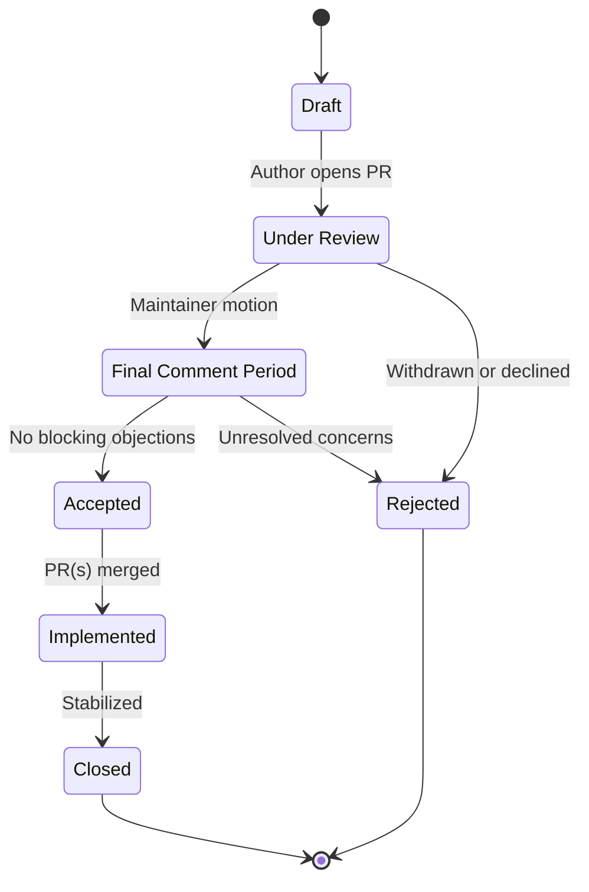

# RFC Process

> *Orca Deep Learning Framework — Foundational Document*
> *"Simple by default. Powerful when needed."*

---

## 1. Introduction

### What Is an RFC?

An **RFC (Request for Comments)** is a design document that proposes a significant change to Orca. It describes the *what*, *why*, and *how* of a change before implementation begins. An RFC is not a specification frozen in stone—it is a living proposal that evolves through community discussion until consensus is reached.

### Why We Use RFCs

Deep learning frameworks are foundational infrastructure. A single poorly considered API decision can cascade into thousands of downstream breakages and years of maintenance burden. The RFC process exists to:

1. **Force clear thinking.** Writing a proposal reveals gaps in reasoning that informal discussion cannot.
2. **Create a public record.** Every major decision is documented, searchable, and attributable.
3. **Enable asynchronous collaboration.** Contributors across time zones can participate meaningfully.
4. **Protect stability.** Changes to core abstractions (autograd, memory model, tensor API) receive proportionate scrutiny.
5. **Build shared ownership.** Decisions made through open process carry stronger community buy-in.

### When an RFC Is Required vs. When It Is Not

Not every change needs an RFC. The rule of thumb: **if the change affects how users or contributors think about Orca, it needs an RFC.** If it is invisible to both groups, it probably does not.

---

## 2. When to Write an RFC

### RFC Required

The following changes **must** go through the RFC process:

| Category | Examples |
|---|---|
| **New crate or module** | `orca-distributed`, `orca-quantize` |
| **New core abstraction or trait** | A new `Backend` trait, a `GradientPolicy` trait |
| **Breaking API changes** | Renaming `Tensor::matmul` → `Tensor::mm`, removing a public method |
| **New backend** | Adding Vulkan compute, WebGPU, or TPU support |
| **Changes to the autograd engine** | New gradient accumulation strategy, tape semantics |
| **Changes to the memory model** | New allocator interface, arena lifetime changes |
| **New serialization format** | A new `.orca` checkpoint format |
| **Significant performance architecture changes** | Switching from eager to lazy execution by default |

### RFC Not Required

The following changes **do not** require an RFC and can proceed through normal pull requests:

- **Bug fixes** — correctness issues in existing behavior.
- **Documentation improvements** — typos, clarifications, new examples.
- **Small API additions** — adding a new activation function that follows established patterns.
- **Internal refactors** — restructuring private modules without affecting public API.
- **New tests or benchmarks** — expanding coverage or adding performance baselines.
- **Dependency updates** — bumping crate versions unless it introduces breaking changes.

> [!TIP]
> When in doubt, open a GitHub Discussion titled "Pre-RFC: \<your idea\>" to get lightweight feedback on whether a full RFC is warranted.

---

## 3. RFC Lifecycle

Every RFC moves through a well-defined sequence of states:



### State Definitions

| State | Description | Duration |
|---|---|---|
| **Draft** | The author is still iterating. Not yet open for formal review. | Unlimited |
| **Under Review** | PR is open. Community and maintainers discuss, request changes. | 2–6 weeks typical |
| **Final Comment Period (FCP)** | A maintainer proposes FCP with a disposition (accept/reject). 10 calendar days for last objections. | 10 days |
| **Accepted** | The RFC is approved. Implementation may begin. | — |
| **Rejected** | The RFC is declined. The PR is closed with a summary of reasons. | — |
| **Implemented** | All implementation PRs are merged and the feature is available (possibly behind a feature flag). | — |
| **Closed** | The feature is stabilized and the RFC is archived. | — |

> [!IMPORTANT]
> An accepted RFC is not a guarantee of immediate implementation. It signals that the design is approved and a conforming implementation *will be merged* when submitted.

---

## 4. RFC Template

All RFCs must follow the template below. Copy `docs/rfcs/_TEMPLATE.md` or use this structure directly.

````markdown
# RFC-XXXX: <Title>

| Field        | Value                        |
|--------------|------------------------------|
| **RFC**      | XXXX                         |
| **Title**    | <Descriptive title>          |
| **Author(s)**| <Name (@github_handle)>      |
| **Status**   | Draft                        |
| **Created**  | YYYY-MM-DD                   |
| **Updated**  | YYYY-MM-DD                   |

---

## Summary

<!-- One paragraph. What is this RFC proposing, and why should the reader care? -->

## Motivation

<!-- Why is this change needed? What problems does it solve? What use cases does
     it unlock? Include concrete examples where possible. -->

## Detailed Design

<!-- This is the core of the RFC. Describe the design in enough detail that:
     1. Someone familiar with Orca could implement it.
     2. Someone unfamiliar could understand the high-level architecture.

     Include:
     - New types, traits, and their signatures
     - API surface (public functions, methods, modules)
     - Interaction with existing subsystems
     - Error handling strategy
     - Code examples demonstrating usage -->

## Alternatives Considered

<!-- Describe at least TWO alternative approaches. For each:
     - What is the approach?
     - Why was it not chosen?
     - What are its trade-offs? -->

### Alternative A: <Name>

### Alternative B: <Name>

## Drawbacks

<!-- What are the costs of this proposal?
     - Increased API surface?
     - Performance overhead?
     - Maintenance burden?
     - Learning curve? -->

## Prior Art

<!-- How do other frameworks handle this?
     - PyTorch
     - JAX
     - TensorFlow
     - tinygrad
     - Burn (Rust)
     Include links and brief analysis of their approach. -->

## Unresolved Questions

<!-- What aspects of the design are still open? What needs to be figured out
     during implementation rather than at the RFC stage? -->

## Future Possibilities

<!-- What future work does this RFC enable or suggest? This section is
     intentionally speculative. -->

## Implementation Plan

<!-- Concrete steps to implement this RFC:
     1. Which crates/modules are affected?
     2. What is the rough PR sequence?
     3. Can it be feature-gated for incremental rollout?
     4. Estimated complexity (S/M/L/XL)? -->
````

---

## 5. Review Process

### Who Can Submit RFCs

**Anyone.** You do not need to be a maintainer, a frequent contributor, or affiliated with any organization. If you have a well-reasoned proposal, the process is open to you.

### Who Reviews

Every RFC is reviewed by:

1. **At least two maintainers** from the relevant domain area (e.g., autograd, backends, API).
2. **Domain experts** who are tagged by maintainers when specialized knowledge is needed (e.g., GPU memory management, distributed training protocols).
3. **The broader community**, whose comments carry weight proportional to their technical substance.

### Review Criteria

Reviewers evaluate RFCs against the following criteria:

| Criterion | Description |
|---|---|
| **Alignment** | Does the proposal align with Orca's philosophy of simplicity and progressive complexity? |
| **Necessity** | Does this solve a real problem that enough users face? |
| **Completeness** | Is the design detailed enough to implement without ambiguity? |
| **Compatibility** | Does it preserve backward compatibility, or is the breakage justified? |
| **Performance** | Are there measurable performance implications, and are they acceptable? |
| **Alternatives** | Were alternatives genuinely considered, or dismissed superficially? |
| **Maintainability** | Can this be maintained long-term without disproportionate effort? |

### How Consensus Is Reached

Orca uses a **lazy consensus** model:

1. A maintainer proposes entering FCP with a disposition: `merge`, `close`, or `postpone`.
2. All other maintainers in the relevant team have 10 calendar days to raise a **blocking objection**.
3. A blocking objection must be *technical and specific*—"I don't like it" is not blocking.
4. If no blocking objection is raised, the FCP disposition is enacted.
5. If a blocking objection is raised, the RFC returns to Under Review for further iteration.

### Veto Power and Conflict Resolution

- Any single maintainer can raise a blocking objection, but must provide a clear technical rationale and a constructive path forward.
- If maintainers deadlock, the **project lead** makes the final call after summarizing all positions publicly.
- The project lead's decision is final for the current proposal, but the underlying issue can be revisited in a future RFC with new information.

### Timeline Expectations

| Phase | Expected Duration |
|---|---|
| Draft → Under Review | Author's discretion |
| Under Review | 2–6 weeks |
| Final Comment Period | 10 calendar days (firm) |
| Accepted → Implementation begins | Within 1 release cycle |
| Implementation → Closed | Varies by complexity |

> [!NOTE]
> These are expectations, not hard deadlines. Complex RFCs (e.g., new backend support) may take longer. Simple RFCs (e.g., a new trait) may move faster.

---

## 6. RFC Numbering and Storage

### Numbering Scheme

RFCs are numbered sequentially, zero-padded to four digits:

```
RFC-0001, RFC-0002, ..., RFC-0042, ..., RFC-0999, RFC-1000
```

The next available number is assigned when an RFC PR is opened, not when it is accepted.

### File Location

All RFCs are stored in the repository under:

```
docs/rfcs/
├── _TEMPLATE.md
├── RFC-0001-tensor-api-v2.md
├── RFC-0002-bfloat16-support.md
├── RFC-0003-distributed-backend.md
└── ...
```

### Filename Convention

```
RFC-XXXX-short-kebab-case-title.md
```

- Use the RFC number prefix for sorting.
- Use a short, descriptive kebab-case slug (3–6 words).
- Always use the `.md` extension.

### Index

Maintain an `INDEX.md` file in `docs/rfcs/` that lists all RFCs with their number, title, status, and date:

```markdown
| RFC | Title | Status | Date |
|-----|-------|--------|------|
| [0001](RFC-0001-tensor-api-v2.md) | Tensor API v2 | Closed | 2025-03-15 |
| [0002](RFC-0002-bfloat16-support.md) | BFloat16 Support | Accepted | 2025-06-01 |
```

---

## 7. Example RFC

The following is a complete example of a well-written RFC.

---

# RFC-0002: BFloat16 Support

| Field        | Value                                   |
|--------------|-----------------------------------------|
| **RFC**      | 0002                                    |
| **Title**    | Native BFloat16 (bf16) dtype support    |
| **Author(s)**| Jane Doe (@janedoe), Alex Kim (@akim)   |
| **Status**   | Accepted                                |
| **Created**  | 2025-05-10                              |
| **Updated**  | 2025-06-01                              |

---

## Summary

This RFC proposes adding `bf16` (BFloat16) as a first-class data type in Orca's tensor system. BFloat16 retains the exponent range of `f32` while using only 16 bits, making it the *de facto* standard for mixed-precision training on modern accelerators. Orca currently supports `f16`, `f32`, and `f64`; this proposal adds `bf16` as a peer dtype with full autograd support.

## Motivation

BFloat16 has become the dominant reduced-precision format for deep learning training:

1. **Hardware support is universal.** NVIDIA Ampere+, Google TPUs, Intel AMX, and AMD CDNA all have native bf16 ALUs.
2. **Training stability.** Unlike IEEE `f16`, `bf16` matches `f32`'s exponent range (8 bits), virtually eliminating overflow during training. This removes the need for loss scaling in most workloads.
3. **User demand.** Issues #127, #203, and #341 all request bf16 support. Multiple users report switching to PyTorch solely for this feature.

Without bf16, Orca cannot be used for practical large-model training on modern hardware.

## Detailed Design

### New Type

```rust
// orca-core/src/dtype.rs

/// BFloat16: 1 sign bit, 8 exponent bits, 7 mantissa bits.
#[derive(Clone, Copy, Debug, PartialEq)]
pub struct BFloat16(u16);

impl DType for BFloat16 {
    const DTYPE_ID: DTypeId = DTypeId::BF16;
    const SIZE: usize = 2;
}
```

### DType Enum Extension

```rust
pub enum DTypeId {
    F16,
    BF16,   // ← new
    F32,
    F64,
    U8,
    I32,
    I64,
}
```

### Tensor API

No new methods are required. Existing dtype-generic methods work automatically:

```rust
let x = Tensor::randn(&[2, 3], DTypeId::BF16, &device);
let y = x.matmul(&w);          // bf16 × bf16 → bf16
let z = y.to_dtype(DTypeId::F32); // explicit upcast
```

### Autograd

Gradient computation respects the "widen on accumulate" rule:

- Forward pass: `bf16`
- Gradient accumulation: `f32` (to preserve precision)
- Stored gradients: configurable via `GradPolicy`, default `f32`

### Backend Requirements

| Backend | bf16 Status | Notes |
|---------|-------------|-------|
| CPU | Software emulation via `half` crate | Functional but slow; acceptable for debugging |
| CUDA | Native (sm_80+), emulated (sm_70) | Use `__nv_bfloat16` intrinsics |
| Metal | Native (Apple M1+) | Use `bfloat` type |
| Vulkan | Not supported | Falls back to f16 with warning |

### Casting Rules

```
bf16 → f32  : lossless (zero-extend mantissa)
f32  → bf16 : lossy (truncate mantissa, round-to-nearest-even)
bf16 → f16  : lossy (different exponent/mantissa split)
f16  → bf16 : lossy (different exponent/mantissa split)
```

## Alternatives Considered

### Alternative A: Treat bf16 as an External Plugin

Users could implement bf16 via a third-party crate and a custom `DType` registration mechanism.

**Rejected because:** Deep integration with autograd, serialization, and backend dispatch requires dtype knowledge at the core level. A plugin cannot intercept gradient accumulation policy or backend kernel dispatch without invasive hooks that would constitute a larger API change than this RFC.

### Alternative B: Support Only bf16 Storage, Compute in f32

Tensors could be *stored* in bf16 but automatically upcast to f32 for all computation, similar to TensorFlow's early `tf.bfloat16` behavior.

**Rejected because:** This eliminates the primary performance benefit of bf16. Modern hardware achieves 2× throughput on bf16 matmuls compared to f32. Storage-only support would mislead users into expecting performance gains they cannot achieve.

## Drawbacks

1. **Increased dtype combinatorics.** Every kernel must now handle an additional dtype, increasing the testing matrix.
2. **CPU performance.** Software-emulated bf16 on CPU is slower than f32. Users may be surprised by this.
3. **Vulkan gap.** Vulkan has no bf16 support, creating an asymmetry across backends.

## Prior Art

| Framework | bf16 Support | Notes |
|-----------|-------------|-------|
| **PyTorch** | `torch.bfloat16` — first-class dtype since v1.7 | Full autograd, AMP integration |
| **JAX** | `jnp.bfloat16` — native on TPU, supported on GPU | Follows NumPy dtype conventions |
| **TensorFlow** | `tf.bfloat16` — introduced for TPU workloads | Auto-cast via `tf.keras.mixed_precision` |
| **Burn (Rust)** | Supported via the `half` crate | Similar architecture to this proposal |

Our approach most closely follows Burn's design, adapted to Orca's trait-based dtype system and backend dispatch model.

## Unresolved Questions

1. **Should bf16 be the default dtype for mixed-precision training?** This RFC adds bf16 as an option; a future RFC should address an `AutoMixedPrecision` policy.
2. **Serialization backward compatibility.** Can existing `.orca` checkpoint files be extended to include bf16 tensors without a format version bump?
3. **Operator coverage timeline.** Which operators are required for the initial PR, and which can follow incrementally?

## Future Possibilities

- **Automatic mixed-precision (AMP) engine** that selects bf16/f32 per-operator based on numerical sensitivity profiles.
- **FP8 (E4M3/E5M2) support** using the same dtype extension pattern established here.
- **Quantization-aware training** that leverages bf16 as an intermediate precision between f32 and int8.

## Implementation Plan

1. **PR 1 — Core dtype** (`orca-core`): Add `BFloat16` struct, `DTypeId::BF16` variant, and casting implementations. Depends on `half` crate v2.x. *Size: M.*
2. **PR 2 — CPU backend**: Software-emulated bf16 kernels for element-wise ops, matmul, and reductions. *Size: M.*
3. **PR 3 — CUDA backend**: Native bf16 kernels using `__nv_bfloat16`. Feature-gated behind `cuda-bf16`. *Size: L.*
4. **PR 4 — Autograd**: bf16-aware gradient accumulation with configurable `GradPolicy`. *Size: M.*
5. **PR 5 — Metal backend**: Native bf16 support for Apple Silicon. *Size: M.*
6. **PR 6 — Serialization**: Extend `.orca` format to encode bf16 tensors. *Size: S.*
7. **PR 7 — Documentation and examples**: Mixed-precision training tutorial. *Size: S.*

Feature-gated under `#[cfg(feature = "bf16")]` until all PRs are merged and stabilized.

---

*End of example RFC.*

---

## Appendix: Quick Reference

### Checklist Before Opening an RFC PR

- [ ] Used the template from `docs/rfcs/_TEMPLATE.md`
- [ ] Assigned the next available RFC number
- [ ] Filled in all template sections (no "TODO" placeholders)
- [ ] Provided at least two alternatives in "Alternatives Considered"
- [ ] Listed prior art from at least two other frameworks
- [ ] Included concrete code examples in "Detailed Design"
- [ ] Described an incremental implementation plan
- [ ] Self-reviewed for clarity, grammar, and completeness

### Checklist for Reviewers

- [ ] The motivation justifies the complexity introduced
- [ ] The design is consistent with Orca's existing API conventions
- [ ] Performance implications are documented and acceptable
- [ ] The alternatives analysis is genuine, not strawman
- [ ] Unresolved questions are scoped and not blockers for acceptance
- [ ] The implementation plan is realistic and incremental

---

*This document is itself governed by the RFC process. To propose changes, open RFC-XXXX-rfc-process-amendment.md.*
