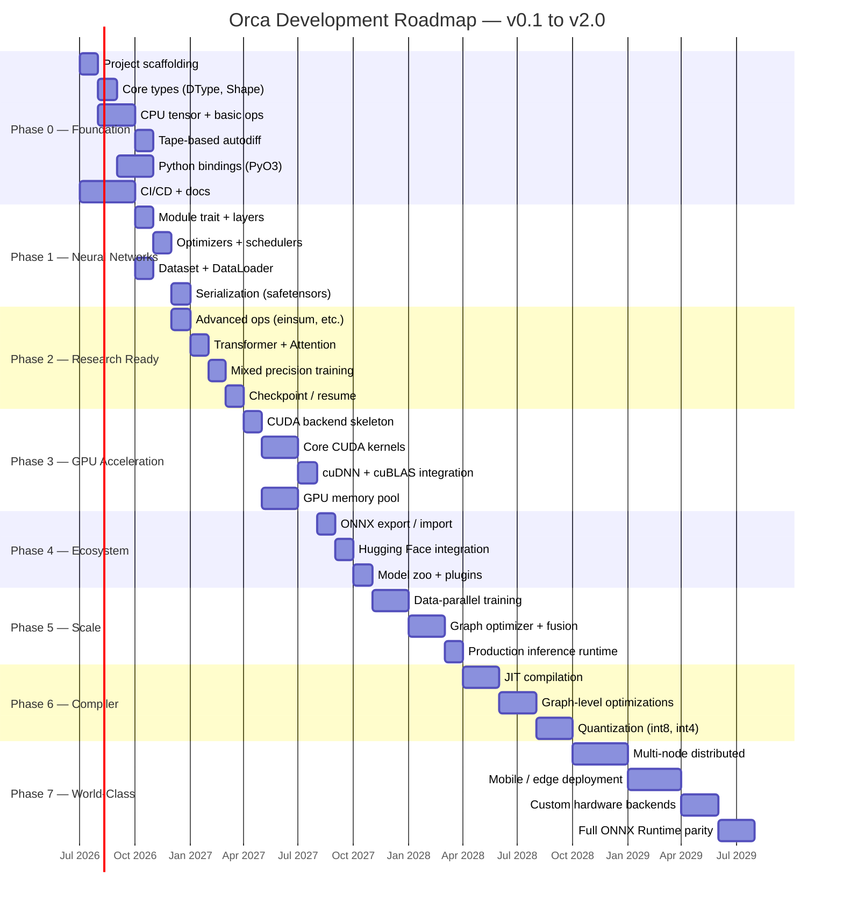

# Orca Roadmap

> **"Simple by default. Powerful when needed."**

This document defines the development roadmap for the Orca deep learning framework
from initial proof-of-concept (v0.1) through world-class production readiness (v2.0).
Each phase builds on the previous one, and no phase may be skipped. Exit criteria are
binary: every item must be met before the phase is considered complete.

| Field | Value |
|---|---|
| **Status** | Living document |
| **Owner** | Core team |
| **Created** | 2026-07-03 |
| **Last updated** | 2026-07-03 |
| **Review cadence** | Every phase boundary |

> [!IMPORTANT]
> This roadmap is a **commitment to sequence**, not a commitment to calendar dates.
> Timelines are estimates. If a phase takes longer than projected, subsequent phases
> shift accordingly. Quality is never sacrificed for schedule.

---

## Timeline Overview

---

## Versioning Contract

Orca follows [Semantic Versioning 2.0.0](https://semver.org/). Pre-1.0 releases
(`0.x.y`) carry **no API stability guarantee**. Starting at v1.0.0, all public APIs
are covered by semver: breaking changes require a major version bump.

| Version range | Stability | Audience |
|---|---|---|
| `0.1.x – 0.3.x` | Experimental | Core contributors only |
| `0.4.x – 0.5.x` | Beta | Early adopters, researchers |
| `1.0.x` | Stable | General availability |
| `1.5.x` | Stable + compiler | Performance-sensitive users |
| `2.0.x` | Mature | Production, enterprise |

---

## Phase 0: Foundation (v0.1.0) — "First Breath"

**Timeline:** Months 1–3

### Goals

Establish the structural skeleton of the entire project. Every crate that will ever
exist is at least stubbed. The Rust↔Python bridge works end-to-end. A developer can
clone the repo, run `cargo test`, and see green. A Python user can compute gradients
of simple arithmetic expressions.

### Key Deliverables

| # | Deliverable | Crate | Description |
|---|---|---|---|
| 0.1 | Cargo workspace | `orca` (root) | Workspace manifest with all member crates, unified dependency versions, feature flags |
| 0.2 | Python package scaffold | `orca-python` | `pyproject.toml`, maturin build, `import orca` works |
| 0.3 | Core type system | `orca-core` | `DType` enum (`f32`, `f64`, `bf16`, `f16`, `i32`, `i64`, `bool`), `Shape`, `Device` enum (`Cpu`, `Cuda(ordinal)`), `Strides` |
| 0.4 | Error hierarchy | `orca-core` | `OrcaError` with variants: `ShapeMismatch`, `DTypeMismatch`, `DeviceMismatch`, `OutOfMemory`, `InvalidArgument`, `BackendError` |
| 0.5 | CPU tensor | `orca-tensor` | Dense, contiguous, row-major tensor backed by `Vec<T>`. Supports `f32` and `f64` at minimum |
| 0.6 | Basic arithmetic | `orca-tensor` | Element-wise `add`, `sub`, `mul`, `div` with broadcasting; `matmul` for 2-D tensors |
| 0.7 | Tape-based autodiff | `orca-autograd` | Reverse-mode autodiff using a Wengert tape. Supports gradients for all ops in 0.6 |
| 0.8 | Python bindings | `orca-python` | `orca.Tensor` class in Python, basic operator overloads (`+`, `-`, `*`, `/`, `@`), `.backward()`, `.grad` |
| 0.9 | CI/CD pipeline | — | GitHub Actions: `cargo fmt --check`, `cargo clippy`, `cargo test`, `maturin build`, Python `pytest` |
| 0.10 | Documentation | — | `README.md`, architecture overview, getting-started guide, rustdoc for all public items |

### Success Metrics

- [ ] `cargo test --workspace` passes with 0 failures, 0 warnings.
- [ ] `cargo clippy --workspace -- -D warnings` passes.
- [ ] Python: `orca.tensor([2.0, 3.0]).sum().backward()` produces correct gradients.
- [ ] CI pipeline runs in < 10 minutes.
- [ ] Rustdoc coverage ≥ 90% for public items.

### Dependencies

None. This is the root phase.

### Risks

| Risk | Likelihood | Impact | Mitigation |
|---|---|---|---|
| PyO3 ABI compatibility issues | Medium | High | Pin PyO3 version, test with multiple Python versions (3.9–3.12) |
| Autograd tape design locks in wrong abstraction | Medium | Critical | Study Tinygrad, Micrograd, candle; write RFC before implementing |
| Scope creep — adding too many dtypes/ops early | High | Medium | Hard cap: 4 arithmetic ops + matmul for v0.1 |

### Exit Criteria

1. All deliverables (0.1–0.10) are merged to `main`.
2. All success metrics checked.
3. At least one external contributor can build from source following the docs.
4. Architecture Bible (02-ARCHITECTURE.md) is written and approved.

---

## Phase 1: Neural Networks (v0.2.0) — "First Hunt"

**Timeline:** Months 3–5

### Goals

Provide a usable neural network API. A user can define a model, load a dataset,
choose an optimizer, and train to convergence — all from Python, in under 10 lines
of code (Level 1 API).

### Key Deliverables

| # | Deliverable | Crate | Description |
|---|---|---|---|
| 1.1 | `Module` trait | `orca-nn` | `fn forward(&self, input: &Tensor) -> Result<Tensor>`, `fn parameters(&self) -> Vec<&Tensor>`, `fn train(&mut self)` / `fn eval(&mut self)` |
| 1.2 | Linear layer | `orca-nn` | `Linear { weight, bias }` with Xavier initialization |
| 1.3 | Conv2d | `orca-nn` | 2-D convolution with configurable `kernel_size`, `stride`, `padding`, `dilation`, `groups` |
| 1.4 | Activations | `orca-nn` | `ReLU`, `GELU`, `Sigmoid`, `Tanh`, `Softmax` |
| 1.5 | BatchNorm, LayerNorm | `orca-nn` | Running-mean normalization layers |
| 1.6 | Dropout | `orca-nn` | Standard dropout with configurable `p`, respects train/eval mode |
| 1.7 | SGD optimizer | `orca-optim` | With momentum and weight decay |
| 1.8 | Adam / AdamW | `orca-optim` | Full Adam with decoupled weight decay variant |
| 1.9 | LR schedulers | `orca-optim` | `StepLR`, `CosineAnnealingLR`, `LinearWarmup` |
| 1.10 | `Dataset` trait | `orca-data` | `fn len()`, `fn get(index) -> Sample` |
| 1.11 | DataLoader | `orca-data` | Batching, shuffling, single-threaded iteration |
| 1.12 | Transforms | `orca-data` | `Normalize`, `ToTensor`, `RandomCrop`, `RandomFlip` |
| 1.13 | safetensors I/O | `orca-serialize` | Save and load model state dicts in safetensors format |

### Success Metrics

- [ ] MNIST accuracy ≥ 97% with a 2-layer MLP trained in < 60 seconds (CPU).
- [ ] Training script is ≤ 10 lines of Python (Level 1 API).
- [ ] Model can be saved, loaded, and inference reproduces identical results.
- [ ] All layers have gradient correctness tests (numerical gradient checking).
- [ ] DataLoader handles datasets that don't divide evenly by batch size.

### Dependencies

- **Phase 0:** Core types, tensor ops, autograd, Python bindings.

### Risks

| Risk | Likelihood | Impact | Mitigation |
|---|---|---|---|
| `Module` trait design doesn't generalize | Medium | Critical | Study PyTorch `nn.Module`, Flax `linen`, candle; write RFC |
| Conv2d on CPU is too slow for usability | High | Medium | Use `im2col` + matmul; accept slowness, GPU comes in Phase 3 |
| safetensors format version drift | Low | Low | Pin `safetensors` crate version |

### Exit Criteria

1. All deliverables (1.1–1.13) merged to `main`.
2. MNIST example runs end-to-end and achieves ≥ 97% accuracy.
3. All success metrics checked.
4. Python API docstrings complete for all public classes.

---

## Phase 2: Research Ready (v0.3.0) — "Deep Dive"

**Timeline:** Months 5–8

### Goals

Enable researchers to implement non-trivial architectures (Transformers, GANs, etc.)
using Orca. Provide the primitives needed for custom training loops, mixed precision,
and experiment management.

### Key Deliverables

| # | Deliverable | Crate | Description |
|---|---|---|---|
| 2.1 | `einsum` | `orca-tensor` | Einstein summation with string notation |
| 2.2 | `scatter` / `gather` | `orca-tensor` | Indexed scatter and gather along arbitrary dimensions |
| 2.3 | Advanced indexing | `orca-tensor` | Boolean masking, fancy indexing, slice assignment |
| 2.4 | `Transformer` block | `orca-nn` | Encoder + decoder block with configurable heads, dims, ff size |
| 2.5 | `MultiHeadAttention` | `orca-nn` | Scaled dot-product attention with optional causal mask |
| 2.6 | `Embedding` | `orca-nn` | Embedding lookup table with optional padding_idx |
| 2.7 | Custom training loops | `orca-python` | Level 3 API: explicit forward, backward, step, zero_grad |
| 2.8 | Gradient accumulation | `orca-autograd` | Accumulate gradients over N micro-batches before stepping |
| 2.9 | Gradient clipping | `orca-optim` | `clip_grad_norm_` and `clip_grad_value_` |
| 2.10 | Mixed precision | `orca-autograd` | `autocast` context manager, `GradScaler` for loss scaling |
| 2.11 | Checkpointing | `orca-serialize` | Save/resume full training state (model + optimizer + epoch + RNG) |

### Success Metrics

- [ ] A 6-layer Transformer trains on WikiText-2 and achieves perplexity < 100.
- [ ] Mixed precision training produces results within 1% of fp32 baseline.
- [ ] Training can be interrupted and resumed from checkpoint with bit-exact continuation.
- [ ] `einsum` supports all two-operand contractions.
- [ ] All new ops have autograd support with numerical gradient checks.

### Dependencies

- **Phase 1:** Module system, optimizers, data loading, serialization.

### Risks

| Risk | Likelihood | Impact | Mitigation |
|---|---|---|---|
| `einsum` parser complexity | Medium | Medium | Start with two-operand only; defer N-operand to future release |
| Mixed precision on CPU is meaningless perf-wise | High | Low | Implement for correctness; performance gains come with GPU |
| Transformer API design churn | Medium | Medium | Follow PyTorch conventions closely for familiarity |

### Exit Criteria

1. All deliverables (2.1–2.11) merged to `main`.
2. Transformer training example runs end-to-end.
3. Checkpoint round-trip test passes.
4. All success metrics checked.

---

## Phase 3: GPU Acceleration (v0.4.0) — "Breaking Surface"

**Timeline:** Months 8–12

### Goals

Unlock GPU training. After this phase, Orca should be **usable** (not just
demonstrable) for real model training. Performance does not need to match PyTorch
yet, but must be within 3× for core operations.

### Key Deliverables

| # | Deliverable | Crate | Description |
|---|---|---|---|
| 3.1 | CUDA backend scaffold | `orca-backend-cuda` | Device enumeration, context management, stream handling |
| 3.2 | GPU memory pool | `orca-backend-cuda` | Caching allocator with configurable pool size, OOM handling |
| 3.3 | Core CUDA kernels | `orca-backend-cuda` | Element-wise ops, reduction ops, broadcasting |
| 3.4 | cuBLAS integration | `orca-backend-cuda` | `matmul`, `gemm`, `batched_gemm` via cuBLAS |
| 3.5 | cuDNN integration | `orca-backend-cuda` | Conv2d forward + backward, BatchNorm forward + backward |
| 3.6 | CPU↔GPU transfer | `orca-tensor` | `.to(device)`, `.cpu()`, `.cuda()`, automatic transfer on ops |
| 3.7 | GPU autograd | `orca-autograd` | Tape records device info; backward pass runs on correct device |

### Success Metrics

- [ ] MNIST training is ≥ 5× faster on GPU vs. CPU (same batch size).
- [ ] GPU `matmul` throughput is within 3× of PyTorch on NVIDIA A100.
- [ ] Memory pool reclaims memory without fragmentation for standard workloads.
- [ ] `.to("cuda")` and `.to("cpu")` round-trip preserves tensor values exactly.
- [ ] No CUDA memory leaks after 1000 training steps (checked with `cuda-memcheck`).

### Dependencies

- **Phase 2:** All CPU ops must exist before porting to GPU.

### Risks

| Risk | Likelihood | Impact | Mitigation |
|---|---|---|---|
| CUDA kernel bugs are hard to debug | High | High | Extensive CPU reference tests; compare GPU output against CPU |
| Memory pool fragmentation under real workloads | Medium | High | Study PyTorch's caching allocator design; start simple |
| cuDNN/cuBLAS version compatibility matrix | Medium | Medium | Support CUDA 11.8+ and 12.x; document requirements |
| Compilation times explode with CUDA code | Medium | Medium | Feature-gate CUDA behind `cuda` feature; separate CI job |

### Exit Criteria

1. All deliverables (3.1–3.7) merged to `main`.
2. All existing tests pass on both CPU and CUDA backends.
3. MNIST + Transformer examples run on GPU.
4. Performance benchmarks published in `benchmarks/` directory.
5. All success metrics checked.

---

## Phase 4: Ecosystem (v0.5.0) — "Pod Formation"

**Timeline:** Months 12–15

### Goals

Make Orca a citizen of the broader ML ecosystem. Users can import models from
Hugging Face, export to ONNX, and integrate with standard tooling. Third-party
extensibility via plugins.

### Key Deliverables

| # | Deliverable | Crate | Description |
|---|---|---|---|
| 4.1 | ONNX export | `orca-onnx` | Export Orca models to ONNX format (opset 17+) |
| 4.2 | ONNX import | `orca-onnx` | Load ONNX models and convert to Orca modules |
| 4.3 | Hugging Face hub | `orca-hf` | Download/upload models from/to Hugging Face Hub |
| 4.4 | HF model conversion | `orca-hf` | Convert HF PyTorch checkpoints to Orca format |
| 4.5 | Model zoo | `orca-zoo` | Pre-trained ResNet, BERT-base, GPT-2 small |
| 4.6 | Plugin system | `orca-core` | `Backend` trait + dynamic loading for third-party backends |
| 4.7 | Parallel data loading | `orca-data` | Multi-worker DataLoader with prefetch buffer |
| 4.8 | Data caching | `orca-data` | On-disk caching for preprocessed datasets |
| 4.9 | Logging / metrics | `orca-train` | TensorBoard-compatible event file writer; stdout progress bars |

### Success Metrics

- [ ] ONNX export → ONNX Runtime inference produces outputs within `atol=1e-5` of Orca.
- [ ] `orca.hub.load("bert-base-uncased")` works out of the box.
- [ ] Model zoo models achieve published accuracy on standard benchmarks.
- [ ] Parallel DataLoader achieves ≥ 2× throughput vs. single-threaded on I/O-bound tasks.
- [ ] Plugin system allows registering a custom backend without modifying Orca source.

### Dependencies

- **Phase 3:** GPU backend needed for practical model zoo usage.
- **Phase 2:** Transformer modules needed for BERT/GPT-2 model zoo.

### Risks

| Risk | Likelihood | Impact | Mitigation |
|---|---|---|---|
| ONNX opset coverage is massive | High | Medium | Start with ops used by ResNet + BERT; expand on demand |
| Hugging Face checkpoint format changes | Medium | Medium | Version-pin safetensors; handle format negotiation |
| Plugin ABI stability is hard in Rust | High | High | Use C ABI + trait objects; document stability guarantees |

### Exit Criteria

1. All deliverables (4.1–4.9) merged to `main`.
2. ONNX round-trip test passes for ResNet-18 and BERT-base.
3. Hugging Face load example works without manual conversion.
4. All success metrics checked.

---

## Phase 5: Scale (v1.0.0) — "Open Ocean"

**Timeline:** Months 15–20

> [!IMPORTANT]
> This is the **1.0 release**. After this point, all public APIs are covered by
> semantic versioning. Breaking changes require a major version bump. The bar for
> quality, documentation, and testing is significantly higher than pre-1.0 phases.

### Goals

Orca is production-ready. Multi-GPU training works. The computation graph is
optimized automatically. Memory usage is competitive. Documentation is
comprehensive. The API is stable.

### Key Deliverables

| # | Deliverable | Crate | Description |
|---|---|---|---|
| 5.1 | Data-parallel training | `orca-distributed` | `DataParallel` wrapper; NCCL-based all-reduce |
| 5.2 | Computation graph | `orca-graph` | Capture forward pass as a static graph for optimization |
| 5.3 | Operator fusion | `orca-graph` | Fuse element-wise chains, fuse bias+activation |
| 5.4 | Gradient checkpointing | `orca-autograd` | Trade compute for memory on long sequences |
| 5.5 | Inference runtime | `orca-inference` | Optimized inference-only execution (no autograd overhead) |
| 5.6 | API freeze + docs | — | Comprehensive API reference, tutorials, migration guide |
| 5.7 | Semver enforcement | — | CI check: public API diff against previous release |

### Success Metrics

- [ ] Multi-GPU training scales ≥ 1.8× on 2 GPUs, ≥ 3.4× on 4 GPUs.
- [ ] Operator fusion reduces kernel launch count by ≥ 30% on Transformer forward pass.
- [ ] Gradient checkpointing reduces peak memory by ≥ 40% on a 12-layer Transformer.
- [ ] Inference runtime is ≥ 2× faster than training-mode forward pass.
- [ ] 100% of public API items have rustdoc + Python docstrings.

### Dependencies

- **Phase 4:** Ecosystem integrations must be stable before freezing APIs.
- **Phase 3:** GPU backend required for multi-GPU and fusion.

### Risks

| Risk | Likelihood | Impact | Mitigation |
|---|---|---|---|
| API freeze locks in suboptimal design | Medium | Critical | Extensive beta period (2+ months) with community feedback |
| NCCL integration is complex | High | High | Start with 2-GPU; scale incrementally |
| Graph capture breaks dynamic control flow | High | Medium | Support both eager and graph modes; document limitations |

### Exit Criteria

1. All deliverables merged, all success metrics checked.
2. Public API stable (no breaking changes) for ≥ 8 weeks.
3. At least 3 external users have validated the beta in real projects.

---

## Phase 6: Compiler (v1.5.0) — "Echolocation"

**Timeline:** Months 20–26

### Goals

Introduce a JIT compiler that takes Orca computation graphs and produces optimized
machine code. Quantization enables deployment on resource-constrained hardware.

### Key Deliverables

| # | Deliverable | Crate | Description |
|---|---|---|---|
| 6.1 | JIT compiler | `orca-compiler` | Trace-based JIT: capture, optimize, compile, cache |
| 6.2 | IR definition | `orca-compiler` | Internal intermediate representation for the optimization pipeline |
| 6.3 | Graph optimizations | `orca-compiler` | Constant folding, dead code elimination, common subexpression elimination |
| 6.4 | Target codegen | `orca-compiler` | CPU (via Cranelift or LLVM) and CUDA (via PTX) code generation |
| 6.5 | Quantization | `orca-compiler` | Post-training quantization: `int8`, `int4`; calibration dataset support |
| 6.6 | Model optimization | `orca-compiler` | Weight pruning, knowledge distillation hooks |

### Success Metrics

- [ ] JIT-compiled ResNet-50 inference ≥ 1.5× faster, Transformer ≥ 2× faster than eager.
- [ ] `int8` quantized accuracy within 1% of fp32 baseline on ImageNet.
- [ ] BERT-base compilation time < 30 seconds.
- [ ] Compiled models serializable without recompilation.

### Dependencies

- **Phase 5:** Stable computation graph, operator fusion, inference runtime.

### Risks

| Risk | Likelihood | Impact | Mitigation |
|---|---|---|---|
| Compiler engineering is a multi-year effort | High | Critical | Start with trace-based JIT; grow incrementally |
| Cranelift/LLVM integration complexity | High | High | Abstract behind `Codegen` trait; swap backends later |
| Quantization accuracy loss on edge cases | Medium | Medium | Provide calibration tools; document trade-offs |

### Exit Criteria

1. All deliverables merged, all success metrics checked.
2. JIT compilation works end-to-end for ResNet-50 and BERT-base.
3. Compiler docs cover custom optimization pass authoring.

---

## Phase 7: World-Class (v2.0.0) — "Apex Predator"

**Timeline:** Months 26–36

### Goals

Orca is competitive with PyTorch and JAX for both research and production. Multi-node
distributed training works at scale. Mobile/edge deployment is first-class.
Community-driven development sustains the project beyond the core team.

### Key Deliverables

| # | Deliverable | Crate | Description |
|---|---|---|---|
| 7.1 | Multi-node distributed | `orca-distributed` | Distributed data-parallel + model-parallel across nodes; fault tolerance |
| 7.2 | Pipeline parallelism | `orca-distributed` | GPipe-style pipeline parallelism for very large models |
| 7.3 | Advanced compiler opts | `orca-compiler` | Auto-tuning, polyhedral optimizations, memory planning |
| 7.4 | Mobile runtime | `orca-mobile` | Lightweight inference runtime for iOS (Core ML bridge) and Android (NNAPI bridge) |
| 7.5 | Edge deployment | `orca-edge` | ARM/RISC-V optimized kernels, WASM target |
| 7.6 | Custom hardware API | `orca-backend` | Stable backend trait for third-party hardware (TPU, NPU, custom ASIC) |
| 7.7 | ONNX Runtime parity | `orca-onnx` | Full ONNX opset coverage; pass ONNX conformance test suite |
| 7.8 | Governance model | — | RFC process, committer ladder, release management, security policy |

### Success Metrics

- [ ] Multi-node training scales to 32+ GPUs across 4+ nodes.
- [ ] Pipeline parallelism trains a 1B-parameter model across GPUs.
- [ ] Mobile inference latency within 2× of Core ML / TensorFlow Lite.
- [ ] ONNX conformance test pass rate ≥ 95%.
- [ ] ≥ 20 external contributors; ≥ 3 organizations in production.

### Dependencies

- **Phase 6:** Compiler, quantization needed for mobile/edge.
- **Phase 5:** Multi-GPU training as foundation for multi-node.

### Risks

| Risk | Likelihood | Impact | Mitigation |
|---|---|---|---|
| Multi-node networking is a deep specialty | High | High | Use NCCL/Gloo; don't build custom networking |
| Mobile fragmentation (iOS/Android/WASM) | High | Medium | Prioritize one platform; add others incrementally |
| Competing with PyTorch/JAX on features | High | Critical | Differentiate on Rust safety and simplicity |

### Exit Criteria

1. All deliverables merged, all success metrics checked.
2. Multi-node demo on a real cluster; mobile demo on a physical device.
3. Governance model operational. v2.0.0 tagged on crates.io + PyPI.

---

## Cross-Phase Concerns

These concerns are ongoing throughout the project, not gated to any single phase.

- **Testing:** Unit tests (every PR), integration tests (every PR), gradient checks (autograd PRs), benchmarks (weekly CI), fuzz testing (nightly CI).
- **Documentation:** Rustdoc enforced by `#![deny(missing_docs)]`. Python docstrings for all public classes. Tutorials updated at each phase boundary.
- **Security:** No `unsafe` without safety proof. `cargo audit` + `cargo vet` in CI. Vulnerability disclosure process by Phase 5.

---

## Decision Log

| Date | Decision | Rationale | Phase |
|---|---|---|---|
| 2026-07-03 | Wengert tape for autodiff | Simpler than define-by-run graph; sufficient for Phase 0–2 | 0 |
| 2026-07-03 | safetensors for serialization | Safe, fast, no arbitrary code exec; HF ecosystem alignment | 1 |
| 2026-07-03 | Trace-based JIT over full compiler | Lower complexity; can evolve into full compiler later | 6 |

---

> [!NOTE]
> This roadmap is reviewed at every phase boundary. Check `CHANGELOG.md` for what
> actually shipped vs. what was planned.
